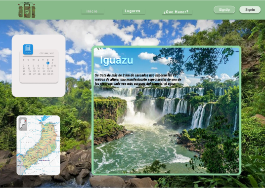

# **PlanV**

PlanV es un sitio en el que los usuarios van a poder ver recomendaciones y puntos de interés en misiones, tal como organizar su viaje dentro de la provincia en las fechas de su estadía.

[Diseño en Figma](https://www.figma.com/design/q5LdBmdDQ4n83maRlW0ANT/Turism-(Community)?node-id=202-394&t=kon795tlBBCiY8pN-0)

## Capturas de pantalla de PlanV

> Follow your heart.

## Contribuir al proyecto

Las contribuciones son el motor que impulsa la comunidad del código abierto, un espacio donde el aprendizaje, la inspiración y la creación se entrelazan. ¡Cada gesto que sumes es valorado enormemente!

Si tienes alguna sugerencia que podría mejorar el proyecto, por favor haz un [Fork](https://github.com/NaylaV/planV/forks "Fork") del repositorio y crea una [pull request](https://github.com/NaylaV/planV/pulls "pull request"). También puedes simplemente abrir un [issue](https://github.com/NaylaV/planV/issues "issue").

Guía rápida:

1. Has un [Fork](https://github.com/NaylaV/planV/forks "Fork") del proyecto
2. Clona tu  [Fork](https://github.com/NaylaV/planV/forks "Fork") (`git clone <URL del fork>`)
3. Añade el repositorio original como remoto (`git remote add upstream <URL del repositorio original>`)
4. Crea tu Rama de Funcionalidad (`git switch -c feature/CaracteristicaIncreible`)
5. Realiza tus Cambios (`git commit -m 'Add: alguna CaracterísticaIncreible'`)
6. Haz Push a la Rama (`git push origin feature/CaracteristicaIncreible`)
7. Abre una [pull request](https://github.com/NaylaV/planV/pulls "pull request")

## :wrench: **Stack**

- [HTML](https://developer.mozilla.org/es/docs/Web/HTML "HTML")
- [CSS](https://developer.mozilla.org/es/docs/Web/CSS "CSS")
-  [JavaScript](https://developer.mozilla.org/es/docs/Web/JavaScript "JavaScript")

